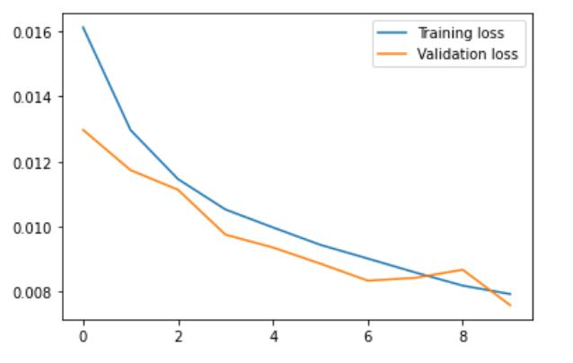

# predictive-modelling-and-condition-monitoring-of-Thruster
Time series analysis and Anomaly Detection of Thruster based on synthetic data

# LSTM-AE based approach to detect anomalies in thruster synthetic data.

One sample file is given in "data" folder which i used to train. 

You can download the rest of the data  and train your own model using train.py file

Dataset: https://www.kaggle.com/datasets/sylar68/spacecraft-thruster-firing-test-dataset
